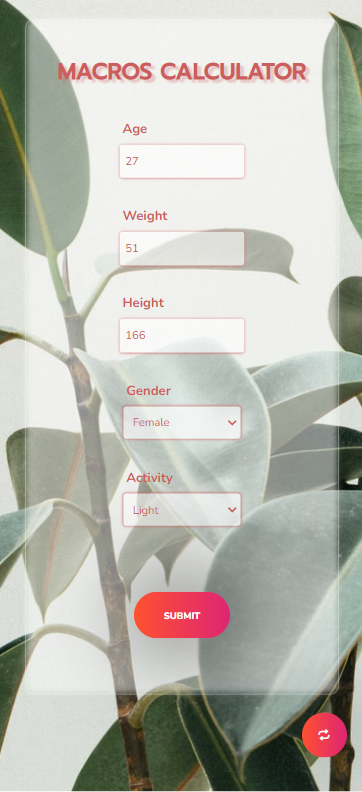
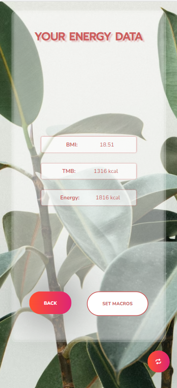
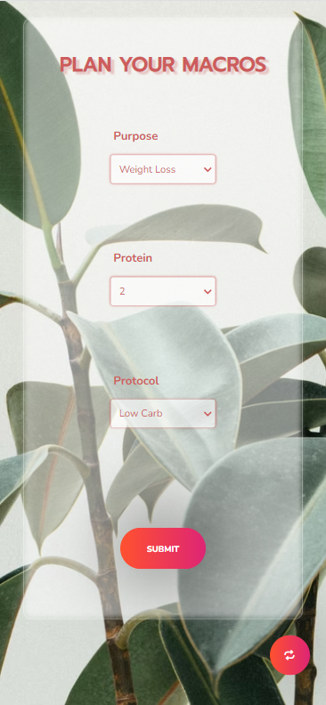
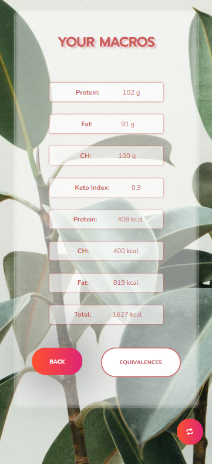
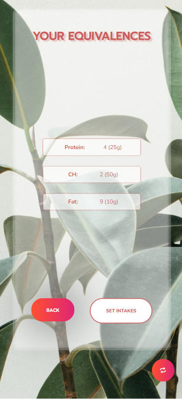

# Macros Calculator 🥑
Vanilla JavaScript project developed for non professional use. This application estimates the macronutrient intake required values given a "patient" personal data.

#### Link to GitHub Pages: 
[](https://afonttorres.github.io/macros-calculator/)

## Tech Stack
+ HTML 5
+ CSS 3
+ ES6 (Vanilla Java Script)

### Version control
+ GIT
+ Git Hub

### Development tools & libraries
+ Visual Studio Code

## Objectives
The main purpose of this application as its name reflect is to calculate the required macronutrient values given users' personal data.

## Features
Starting with user's age, weight, height, gender and activity the application calculates its BMI, TMB and energy requirement. 

From energy requirement and user's body weight the app can esteem every macronutrient approximate required intake taking into account user preferences (which are choosen by a form) such as the protein intake the user would like to use, the approach (low carb, keto,...) and the aim (weight loss, weight gain or body recomposition). 

Once the app has stablished the macronutrient values it divides them by equivalences so its easier for the user to distribute them throught the day.

Every step data is stored in local storage so it can be displayed even though the application reloads, this way user can check its macros without filling the form every time. In need of reset, there's a reset button to remove all data from local storage and enable the first form.

### Design
+ Responsive Web Design
+ Modularity and Scalability (by using recyclable components (html elements))

## Preview
#### Mobile







## Next
Since the aim of the project is to help the user to set its intakes in a healthy and nutritious way, I'd like to add equivalence data for all the macronutrients so user can set its intakes taking these into account. 

In plain language, I would like to translate the macros equivalences into food intakes (for instance: 10g of fat could be equivalent to 20g of nuts) so user can store the choosen equivalences into intakes an set different intakes for a day. Meaning that eventually user would be able to plan its intakes by selecting a food equivalence for each macro equivalence and, this way, plan a whole menu for a day.


## Installation

#### 1. Clone the repository
```bash
 https://github.com/afonttorres/macros-calculator.git
```


#### 2. Run the app by opening it in your favourite server or browser.

## Authors
+ [@afonttorres](https://github.com/afonttorres)

#### Contact me:

[](https://www.linkedin.com/in/agnes-font-torres/)

[Email](mailto:afonttorres@gmail.com)
